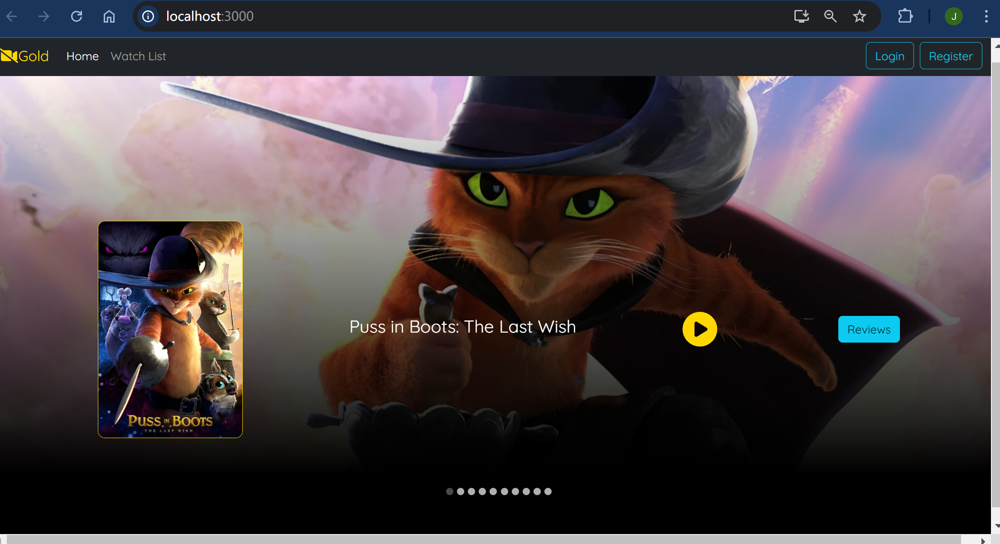
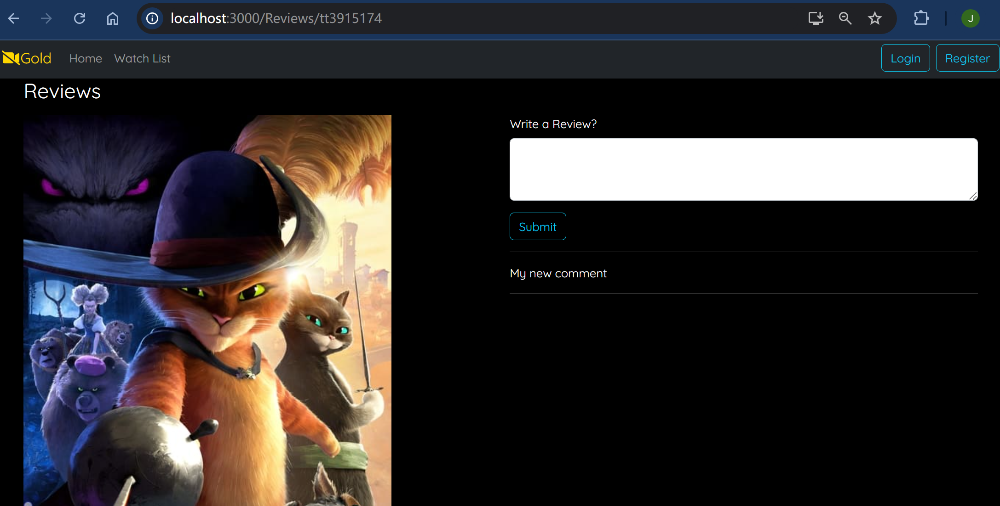
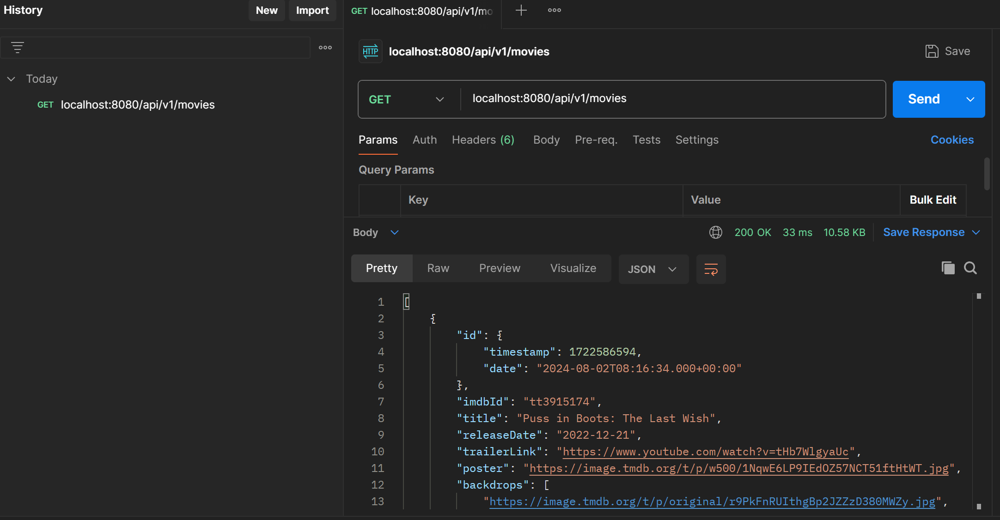

# Movie List App

[](1.png)
[](2.png)

This project is a Movie List application composed of three main components:

1. movie-list-front: The front-end application using REACT.
2. movie-api: The back-end API using Java SpringBoot.
3. mongo-local: The MongoDB database used by the back-end API.

The project is containerized using Docker and orchestrated using Docker Compose.

# Prerequisites
- Docker: Ensure you have Docker installed. Install Docker

# Getting Started
## Clone the Repository
Clone this repository to your local machine:

```sh
git clone https://github.com/hejoseph/MovieListApp.git
cd MovieListApp
```

# Project Structure
The repository contains the following structure:

    .
    ├── movie-list-front/       # Front-end React application
    ├── movie-api/              # Back-end Spring Boot application
    ├── mongo-init/             # MongoDB initialization scripts (if any)
    └── docker-compose.yml      # Docker Compose configuration file

# Running the Application
1. Build and Start the Containers

To start all services (frontend, backend, and database), use the following command in the folder containing 'docker-compose.yml':

```sh
docker-compose up --build
```

This will build the Docker images for the front-end, back-end applications, and the database mongodb defined in the docker-compose.yml file.

2. Accessing the Services

- Front-end: The React application will be available at http://localhost:3000.
- Back-end API: The Spring Boot API will be available at http://localhost:8080.
- MongoDB: MongoDB will be running locally on port 27017.

You can test the API using postman, to check if it is running : 
[](3.png)

# Stopping the Application
To stop the running containers, press Ctrl+C in the terminal where the services are running, or run:

```sh
docker-compose down
```

# Persistent Data (Optional)
If you want to persist MongoDB data between container restarts, uncomment the volume section in the mongo-local service in docker-compose.yml:

    volumes:
    - mongo-local-data:/data/db

# Additional Notes
- Environment Variables: Adjust environment variables such as SPRING_PROFILES_ACTIVE  based on your environment needs.
- MongoDB Initialization: Any scripts placed in the mongo-init directory will be automatically executed when MongoDB starts.

# Contributing
If you'd like to contribute to this project, please fork the repository and use a feature branch. Pull requests are warmly welcome.